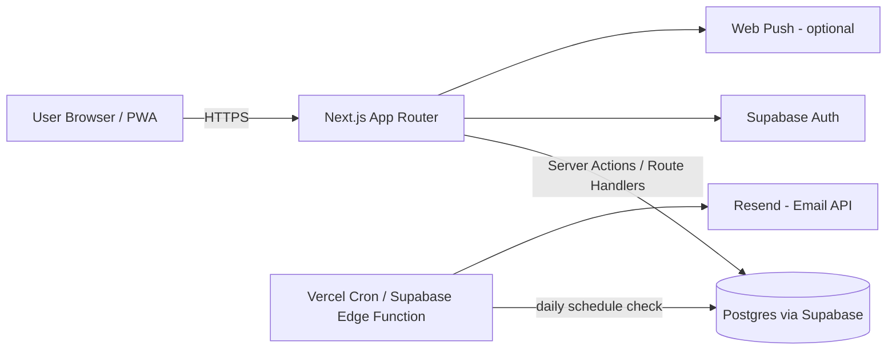

# Tech Stack — Langganin

Selection principle: **solo dev, assisted by an AI coding agent, needs to be built fast, cheap/free to deploy, and match a stack you already know (Next.js, TypeScript, Tailwind).**

## 1. Architecture Overview



Key idea: **fullstack in a single Next.js repo** (no separate backend needed). This is the most efficient setup for a solo developer — you don't have to maintain 2 codebases, and it's also easier for an AI coding agent to reason about a single project.

## 2. Stack Choices per Layer

| Layer | Choice | Reasoning |
|---|---|---|
| Framework | **Next.js 16 (App Router) + TypeScript** | Already in use; supports SSR/Server Actions, easy to deploy on Vercel |
| Styling | **Tailwind CSS v4 + custom claymorphism/glassmorphism design system** | Custom design tokens in `app/globals.css` (`@theme` + `@utility`) — **no shadcn/ui**; components are hand-built to match `04-DESIGN-SYSTEM.md` |
| Auth | **Supabase Auth** (email/password + Google OAuth) | Planned; login/register pages are placeholders, not yet wired |
| Database | **PostgreSQL (Supabase)** | Planned; relational, well-suited to subscription data |
| ORM | **Drizzle ORM** | Planned (see `lib/db/.gitkeep`); lighter & more type-safe than Prisma |
| State/data fetching | **React Context + hooks (client) now; Server Components/Server Actions when the backend lands.** No TanStack Query. | The whole app runs on an in-memory `SubscriptionsProvider` + localStorage. The provider's public API is the stable seam the backend will replace (see `05-SITEMAP-AND-FLOWS.md` §5). |
| Charts | **Recharts** | In use for dashboard pie + analytics charts |
| Animation | **Framer Motion** (`framer-motion`) | Layout animations (language switcher, view toggle), landing-page reveal |
| Forms | **react-hook-form + zod** (`@hookform/resolvers`) | Subscription form validation |
| i18n | **next-intl** | Indonesian (default, prefix-free) + English (`/en`); `lib/messages/{id,en}.json` |
| Fonts | **Space Grotesk** (display) + **Plus Jakarta Sans** (body) via `next/font/google` | Self-hosted at build time — see `04-DESIGN-SYSTEM.md` §3 |
| AI chat | **Vercel AI SDK + OpenRouter** (`@ai-sdk/react`, `@openrouter/ai-sdk-provider`, `ai`) | Streaming `/api/chat` answering questions over the user's subscription snapshot |
| Markdown (chat) | **react-markdown + remark-gfm** | Renders assistant replies |
| Email reminders | **Resend** (planned) | Delivery not wired yet — preferences are saved only |
| Scheduler (cron) | **Vercel Cron Jobs** | Daily job: check renewals/trials → send reminders |
| WhatsApp reminders | **Fonnte** or **Twilio WhatsApp API** | Differentiator; ship email first |
| Hosting | **Vercel** (frontend + API) + **Supabase** (DB/Auth) | Generous free tiers, auto-deploy from GitHub |
| Testing | **Vitest** (unit) — optional for now | Lightweight testing, can be added later |

### Why NOT a separate backend (Express/NestJS/Golang etc.)?
For a solo MVP project like this, splitting off a separate backend only adds deployment & auth complexity without much benefit. Next.js API Routes/Server Actions are already enough for logic like "calculate the next billing date" or "check daily reminders".

## 3. Recommended Folder Structure (actual, mirroring the implemented frontend)

```
langganin/
├── app/
│   ├── [locale]/
│   │   ├── (auth)/login|register/page.tsx
│   │   ├── (dashboard)/
│   │   │   ├── layout.tsx
│   │   │   └── dashboard/{page,subscriptions,subscriptions/[id],calendar,notifications,analytics,settings}/page.tsx
│   │   ├── layout.tsx
│   │   └── page.tsx          # landing page
│   ├── api/
│   │   ├── chat/route.ts     # streaming AI chat (OpenRouter)
│   │   └── health/route.ts
│   ├── health/               # unlocalized health check
│   └── globals.css
├── components/
│   ├── ui/                   # shared primitives (BrandLogo, CategoryBadge, ConfirmDialog, …)
│   ├── layout/               # Sidebar, Topbar, sidebar-context
│   ├── dashboard/            # DashboardClient, SummaryCard, MiniCalendar, UpcomingRenewals
│   ├── subscriptions/        # SubscriptionsProvider, List, Card, Row, Form, DetailModal, CategoryManagerModal, EditClient
│   ├── calendar/             # CalendarClient, Month/Week views, DateDetailPopover, ExportMenu
│   ├── analytics/            # AnalyticsClient, charts, InsightCard
│   ├── notifications/        # NotificationBell, NotificationDropdown, NotificationSettingsClient
│   ├── settings/             # Profile/Payment/NotificationDefaults/DataManagement/About sections
│   ├── chat/                 # ChatPanel, ChatComposer, ChatMessage, ChatMarkdown
│   └── landing/              # LandingNav, ProductPreview, Reveal
├── lib/
│   ├── ai/config.ts          # chat model + system prompt (OpenRouter)
│   ├── brands/brand-registry.ts  # brand detection + Logo.dev URL builder
│   ├── mock/subscriptions.ts # mock seed data
│   ├── services/             # billing-dates.ts, data-management.ts (move to server later)
│   ├── utils/                # analytics, export-{csv,excel,ics}, format-currency, notifications, subscription-{dates,math}
│   ├── messages/{id,en}.json # i18n strings
│   ├── currencies.ts, payment-methods.ts, fonts.ts
│   └── db/                   # (empty — Drizzle schema lands here)
├── types/
│   ├── subscription.ts       # Subscription + Category types (authoritative)
│   └── notifications.ts      # reminder preferences + computed notifications
├── docs/claudeai_mds/        # this documentation set
└── package.json
```

## 4. Core Dependencies (actual package.json)

```
next (16), react, react-dom, typescript
tailwindcss v4, @tailwindcss/postcss
date-fns (REQUIRED for all date math)
zod, react-hook-form, @hookform/resolvers
recharts, framer-motion
next-intl
ai, @ai-sdk/react, @openrouter/ai-sdk-provider
react-markdown, remark-gfm
lucide-react
# (backend, when wired): drizzle-orm, drizzle-kit, postgres, @supabase/supabase-js, @supabase/ssr, resend
```

## 5. Important Note on Dates (a common source of bugs)
- Always store dates in the DB as **UTC** (`timestamptz` in Postgres).
- Calculating the "next billing date" MUST use a library (`date-fns` — `addMonths`, `addWeeks`, etc.), never manually with `+30 days` since month lengths differ.
- When rendering to the user, convert to the Asia/Jakarta timezone.
