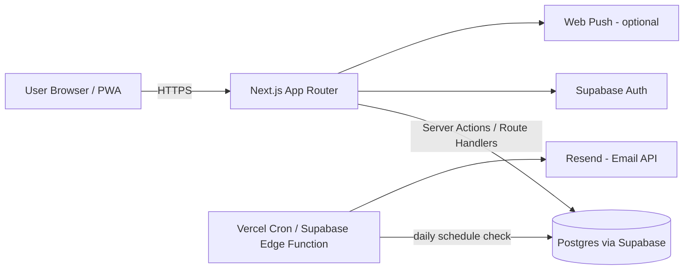

# Tech Stack — Langganin

Selection principle: **solo dev, assisted by an AI coding agent, needs to be built fast, cheap/free to deploy, and match a stack you already know (Next.js, TypeScript, Tailwind).**

## 1. Architecture Overview



Key idea: **fullstack in a single Next.js repo** (no separate backend needed). This is the most efficient setup for a solo developer — you don't have to maintain 2 codebases, and it's also easier for an AI coding agent to reason about a single project.

## 2. Stack Choices per Layer

| Layer | Choice | Reasoning |
|---|---|---|
| Framework | **Next.js 15 (App Router) + TypeScript** | You're already familiar with it, supports SSR/Server Actions, easy to deploy on Vercel |
| Styling | **Tailwind CSS + shadcn/ui** | Fast to build consistent UI, ready-made components (form, dialog, table, calendar) |
| Auth | **Supabase Auth** (email/password + Google OAuth) | Free, already integrated with the DB, no need to set up your own auth server |
| Database | **PostgreSQL (Supabase)** | Relational, well-suited to subscription data (lots of relations & date queries), free tier is enough for MVP |
| ORM | **Drizzle ORM** | Lighter & more type-safe than Prisma, works well with edge runtime, SQL-like queries are easier for an AI agent to read |
| State/data fetching | **Server Components + Server Actions first.** Add **TanStack Query** only for specific interactive parts (e.g. optimistic "mark as paid", polling) | With App Router, most reads can go straight through Server Components with `fetch` caching/`revalidate` — no client-side data-fetching library needed for the MVP. Don't add React Query by default; add it later if a specific screen genuinely needs client-side caching or optimistic updates. |
| Charts | **Recharts** or **Tremor** | Lightweight, good fit for a spending dashboard |
| Fonts | **Bricolage Grotesque** + **Plus Jakarta Sans** via `next/font/google` | Self-hosted at build time by Next.js (no runtime Google Fonts CDN call) — see `04-DESIGN-SYSTEM.md` §3 for the pairing rationale |
| Email reminders | **Resend** | Modern email API, free for small volume, easy to use from Next.js |
| Scheduler (cron) | **Vercel Cron Jobs** (simplest) or Supabase Edge Functions + `pg_cron` | Runs a daily job: check subscriptions about to renew/trials ending → trigger email |
| Push notifications (optional) | **Web Push API** + `next-pwa` | For a native-app-like feel on mobile |
| WhatsApp reminders (Phase 2+, differentiator) | **Fonnte** or **Twilio WhatsApp API** | Most existing subscription trackers only offer Email/Telegram/Discord — WhatsApp is where Indonesian users actually expect reminders. Ship email first; add this once the core loop works, since it's a paid dependency. |
| Hosting | **Vercel** (frontend + API) + **Supabase** (DB/Auth) | Generous free tiers, auto-deploy from GitHub |
| Testing | **Vitest** (unit) — optional for now, prioritize MVP first | Lightweight testing, can be added later |

### Why NOT a separate backend (Express/NestJS/Golang etc.)?
For a solo MVP project like this, splitting off a separate backend only adds deployment & auth complexity without much benefit. Next.js API Routes/Server Actions are already enough for logic like "calculate the next billing date" or "check daily reminders".

## 3. Recommended Folder Structure

```
langganin/
├── app/
│   ├── (auth)/login/page.tsx
│   ├── (auth)/register/page.tsx
│   ├── (dashboard)/dashboard/page.tsx
│   ├── (dashboard)/subscriptions/page.tsx
│   ├── (dashboard)/subscriptions/[id]/page.tsx
│   ├── (dashboard)/calendar/page.tsx
│   ├── api/
│   │   ├── subscriptions/route.ts
│   │   ├── cron/check-renewals/route.ts   # triggered by Vercel Cron
│   │   └── webhooks/                      # if needed later
│   └── layout.tsx
├── components/
│   ├── ui/               # shadcn components
│   ├── subscription-card.tsx
│   ├── dashboard-summary.tsx
│   └── calendar-view.tsx
├── lib/
│   ├── db/
│   │   ├── schema.ts     # Drizzle schema
│   │   └── index.ts      # db client
│   ├── auth.ts
│   ├── email.ts           # Resend wrapper
│   └── date-utils.ts      # logic for next_billing_date, trial_end_date
├── drizzle/                # migration files
├── types/
├── AGENTS.md
├── 01-PRD.md
├── 02-TECH-STACK.md
├── 03-DATABASE-SCHEMA.md
└── package.json
```

## 4. Core Dependencies (rough example package.json)
```
next, react, react-dom, typescript
tailwindcss, @shadcn/ui (via CLI, not a direct npm package)
drizzle-orm, drizzle-kit, postgres (driver)
@supabase/supabase-js, @supabase/ssr
@tanstack/react-query
resend
recharts
date-fns (for date manipulation — REQUIRED, don't calculate manually using native Date)
zod (form & API input validation)
react-hook-form
```

## 5. Important Note on Dates (a common source of bugs)
- Always store dates in the DB as **UTC** (`timestamptz` in Postgres).
- Calculating the "next billing date" MUST use a library (`date-fns` — `addMonths`, `addWeeks`, etc.), never manually with `+30 days` since month lengths differ.
- When rendering to the user, convert to the Asia/Jakarta timezone.
