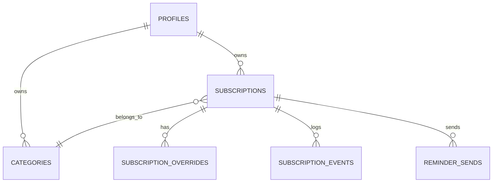

# Database Schema — Langganin

DB: PostgreSQL (via Supabase). ORM: Drizzle.

> Updated to match the implemented frontend (`types/subscription.ts`, `types/notifications.ts`). Key differences from earlier drafts: `payment_method` is now a **free-form string**, trial duration uses `trial_duration` + `trial_duration_unit` (not `trial_duration_days`), and deletion is a **soft delete** with a 14-day retention window.

## 1. ER Diagram (simplified)



## 2. Table: `profiles`
Managed by Supabase Auth (`auth.users`). Holds the per-user settings that the Settings page edits:

| Column | Type | Notes |
|---|---|---|
| id | uuid (PK, FK → auth.users.id) | |
| full_name | text | topbar greeting + avatar initial |
| currency_format | text, default 'id' | `"id"` (Rp 1.000) or `"en"` (1,000.00) |
| default_currency | text, default 'IDR' | |
| payment_methods | text[] | favorite/pinned methods (free-form strings) surfaced first in the form |
| created_at | timestamptz | |

> `budget_monthly_cap` can be added here later for the budget-alert feature.

## 3. Table: `categories`
| Column | Type | Notes |
|---|---|---|
| id | uuid (PK) | |
| user_id | uuid (FK → profiles.id), nullable | null = global default category (read-only) |
| name | text | e.g. "Streaming", "AI Tools", "E-commerce", "Gaming", "Productivity" |
| icon | text, nullable | lucide-react icon name |
| color | text, nullable | hex color for charts/badges |

> Seed default categories on first signup: Streaming, AI Tools, E-commerce Membership, Gaming, Productivity, Other. Users can add/edit/delete their **own** categories; deleting a category moves its subscriptions to `category_id = null`.

## 4. Table: `subscriptions`
| Column | Type | Notes |
|---|---|---|
| id | uuid (PK) | |
| user_id | uuid (FK → profiles.id) | |
| category_id | uuid (FK → categories.id), nullable | |
| name | text | e.g. "Netflix Premium" |
| logo_url | text, nullable | resolved from name via Logo.dev (client-side registry) |
| price | numeric | |
| currency | text, default 'IDR' | |
| billing_cycle | enum: `weekly`, `monthly`, `yearly`, `custom_days` | |
| custom_cycle_days | int, nullable | used when billing_cycle = custom_days |
| start_date | date | subscription start date (not the trial) |
| next_billing_date | date | **auto-calculated** server-side (`lib/services/billing-dates.ts`) |
| status | enum: `active`, `trial`, `paused`, `cancelled` | `cancelled` = **soft-deleted** (see below) |
| is_trial | boolean, default false | |
| trial_start_date | date, nullable | |
| trial_end_date | date, nullable | auto-calculated from trial_start_date + trial_duration + unit |
| trial_duration | int, nullable | 7 / 14 / 30 / custom |
| trial_duration_unit | enum: `days`, `months`, `years`, default `days` | |
| payment_method | text | **free-form** — e.g. "GoPay", "OVO", "Kartu Kredit BCA". Not an enum. |
| notes | text, nullable | |
| created_at | timestamptz | |
| updated_at | timestamptz | |
| deleted_at | timestamptz, nullable | set when status → `cancelled` (soft delete) |

> **Soft delete semantics:** `DELETE` sets `status = "cancelled"` and `deleted_at = now`. Rows are kept for `DELETED_RETENTION_DAYS` (14) so the user can restore them; a job (or a filtered read) purges them after the window. Restore clears `deleted_at` and sets status back to `trial` (if `is_trial`) or `active`.

## 5. Notification preferences

The frontend stores **preferences**, not per-cycle rows. The bell is populated by re-scanning subscriptions against these preferences on every state change.

### 5a. `notification_preferences` (global defaults, one row per user)
| Column | Type | Notes |
|---|---|---|
| user_id | uuid (PK, FK → profiles.id) | |
| days_before | int[] | H- days before a renewal (e.g. `[7,3,1,0]`) |
| trial_days_before | int[] | H- days before a trial ends |
| channels | enum[]: `whatsapp`, `email`, `google_calendar` | |

### 5b. `subscription_overrides` (per-subscription overrides)
| Column | Type | Notes |
|---|---|---|
| id | uuid (PK) | |
| subscription_id | uuid (FK → subscriptions.id, unique) | |
| days_before | int[] | |
| trial_days_before | int[] | |
| channels | enum[] | |

> A subscription with no row here falls back to `notification_preferences`. Read-state for the bell (`read_at` / read id set) can be stored client-side (as today) or in a `notification_reads` table if it must survive across devices.

## 6. Table: `reminder_sends` (send log — replaces the old `reminders` table)
Deduplication log so the cron job never double-sends:

| Column | Type | Notes |
|---|---|---|
| id | uuid (PK) | |
| subscription_id | uuid (FK → subscriptions.id) | |
| days_before | int | the H- window that fired |
| channel | enum: `whatsapp`, `email`, `google_calendar` | |
| target_date | date | the referenced target date (next_billing_date or trial_end_date) |
| sent_at | timestamptz | |

> Daily cron: for each live subscription, for each `days_before` in the effective override, compute `firesOn = target_date - days_before`; if `firesOn = today` and no `reminder_sends` row exists for `(subscription, days_before, channel, target_date)`, send + insert a row.

## 7. Table: `subscription_events`
Append-only history (unchanged — powers Analytics). Logs `payment`, `renewed`, `cancelled`, `paused`, `resumed`, `price_changed`, `trial_started`, `trial_converted`, `restored`.

| Column | Type | Notes |
|---|---|---|
| id | uuid (PK) | |
| subscription_id | uuid (FK → subscriptions.id) | |
| event_type | enum | |
| amount | numeric, nullable | |
| occurred_at | timestamptz | |
| note | text, nullable | |

## 8. Row-Level Security (REQUIRED if using Supabase)
Enable RLS on all user-owned tables (`profiles`, `subscriptions`, `categories`, `notification_preferences`, `subscription_overrides`, `reminder_sends`, `subscription_events`):
```sql
alter table subscriptions enable row level security;
create policy "Users can only access their own subscriptions"
on subscriptions for all
using (auth.uid() = user_id);
```

## 9. Recommended Indexes
```sql
create index idx_subscriptions_user_id on subscriptions(user_id);
create index idx_subscriptions_next_billing_date on subscriptions(next_billing_date);
create index idx_subscriptions_trial_end_date on subscriptions(trial_end_date);
create index idx_subscriptions_status on subscriptions(status);
create index idx_subscriptions_deleted_at on subscriptions(deleted_at);
create index idx_subscription_events_subscription_id on subscription_events(subscription_id);
create index idx_reminder_sends_subscription_target on reminder_sends(subscription_id, target_date);
```
