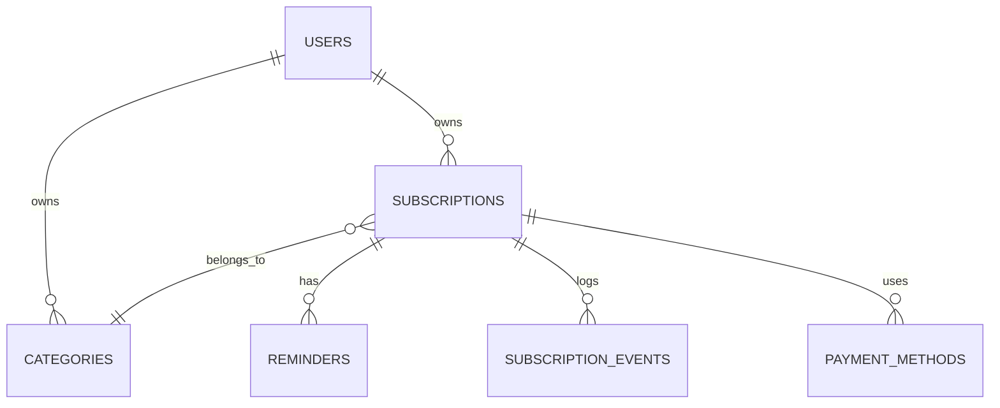

# Database Schema — Langganin

DB: PostgreSQL (via Supabase). ORM: Drizzle.

## 1. ER Diagram (simplified)



## 2. Table: `users`
Managed by Supabase Auth by default (`auth.users`). Add a `profiles` table for extra data:

| Column | Type | Notes |
|---|---|---|
| id | uuid (PK, FK → auth.users.id) | |
| full_name | text | |
| currency_default | text, default 'IDR' | |
| timezone | text, default 'Asia/Jakarta' | |
| budget_monthly_cap | numeric, nullable | for the budget alert feature (Phase 2) |
| created_at | timestamptz | |

## 3. Table: `categories`
| Column | Type | Notes |
|---|---|---|
| id | uuid (PK) | |
| user_id | uuid (FK → profiles.id), nullable | null = global default category |
| name | text | e.g. "Streaming", "AI Tools", "E-commerce", "Gaming", "Productivity" |
| icon | text, nullable | icon name (lucide-react) |
| color | text, nullable | hex color for charts |

> Seed default categories when a user first signs up: Streaming, AI Tools, E-commerce Membership, Gaming, Productivity, Other.

## 4. Table: `subscriptions`
| Column | Type | Notes |
|---|---|---|
| id | uuid (PK) | |
| user_id | uuid (FK → profiles.id) | |
| category_id | uuid (FK → categories.id), nullable | |
| name | text | e.g. "Netflix Premium" |
| logo_url | text, nullable | |
| price | numeric | |
| currency | text, default 'IDR' | |
| billing_cycle | enum: `weekly`, `monthly`, `yearly`, `custom_days` | |
| custom_cycle_days | int, nullable | used when billing_cycle = custom_days |
| start_date | date | subscription start date (not the trial) |
| next_billing_date | date | **auto-calculated**, updated whenever a payment is marked as "paid" |
| status | enum: `active`, `trial`, `paused`, `cancelled` | |
| is_trial | boolean, default false | |
| trial_start_date | date, nullable | |
| trial_end_date | date, nullable | auto-calculated from trial_start_date + trial_duration_days |
| trial_duration_days | int, nullable | 7 / 14 / 30 / custom |
| payment_method | enum: `credit_card`, `debit_card`, `gopay`, `ovo`, `dana`, `shopeepay`, `qris`, `bank_transfer`, `other` | Indonesia-specific e-wallets are explicit values, not a generic "e_wallet" label — this is a deliberate differentiator vs. Western trackers (see `01-PRD.md` §9) |
| notes | text, nullable | |
| created_at | timestamptz | |
| updated_at | timestamptz | |

## 5. Table: `reminders`
Stores the reminder history/rules per subscription (flexible: users can customize how many days ahead they want to be reminded).

| Column | Type | Notes |
|---|---|---|
| id | uuid (PK) | |
| subscription_id | uuid (FK → subscriptions.id) | |
| days_before | int | e.g. 3, 1 |
| channel | enum: `email`, `push`, `whatsapp` | `whatsapp` is Phase 2+ (via a provider like Fonnte/Twilio) — high-value for Indonesian users but adds a paid dependency, so ship `email` first |
| sent_at | timestamptz, nullable | null if not yet sent for this cycle |
| target_date | date | the referenced target date (next_billing_date or trial_end_date) |

> The daily cron job queries: find `subscriptions` where `next_billing_date` or `trial_end_date` minus `days_before` = today, and `sent_at` is still null → send email → update `sent_at`.

## 6. Table: `subscription_events`
Append-only log of things that happen to a subscription over time. This is what makes richer analytics possible later (e.g. "how many times did I get charged for this in the last year", "when did the price change") without having to reconstruct history from the current row state.

| Column | Type | Notes |
|---|---|---|
| id | uuid (PK) | |
| subscription_id | uuid (FK → subscriptions.id) | |
| event_type | enum: `payment`, `renewed`, `cancelled`, `paused`, `resumed`, `price_changed`, `trial_started`, `trial_converted` | |
| amount | numeric, nullable | relevant for `payment` / `price_changed` |
| occurred_at | timestamptz | |
| note | text, nullable | |

> Phase 1 can get away with just updating `subscriptions.status`/`next_billing_date` directly. Add `subscription_events` in Phase 1 anyway if you want the Analytics feature in Phase 2/3 to have real history to chart instead of only a snapshot of "today's state".

## 7. Row-Level Security (REQUIRED if using Supabase)
Enable RLS on all user-owned tables (`subscriptions`, `categories`, `reminders`):
```sql
alter table subscriptions enable row level security;
create policy "Users can only access their own subscriptions"
on subscriptions for all
using (auth.uid() = user_id);
```

## 8. Recommended Indexes
```sql
create index idx_subscriptions_user_id on subscriptions(user_id);
create index idx_subscriptions_next_billing_date on subscriptions(next_billing_date);
create index idx_subscriptions_trial_end_date on subscriptions(trial_end_date);
create index idx_subscription_events_subscription_id on subscription_events(subscription_id);
```
Indexing date columns matters because the dashboard queries and cron job frequently filter/sort by these dates.
